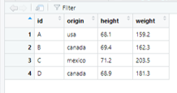

```{r set_knitr_options, echo=FALSE, message=FALSE, warning=FALSE}
suppressMessages(library(knitr))
opts_chunk$set(tidy=FALSE, cache=TRUE, echo=TRUE, message=FALSE)
```

## Learning Objectives

You will learn:

* The basics of R "data objects" and "classes"
* The basic "primitive" data types in R
* How to inspect the properties of data objects
* How to convert data objects to other types
* How to access, assign and display data in R
* How to call functions
* How to use vectorized operations
* How to store, load, and remove data
* How to make comments in R code
* What is unusual about R
* The overall structure of the R language
* The basic "higher order" data structures in R
* How to create categorical variables in R
* How to convert a data object from one structure to another


## Data Objects

R is an *object oriented* language - everything in R is an *object*. What 
this means is that all of your data and code structures are stored in your 
computer's memory using the same framework. 

There are a core set of basic object types and classes built into R. All other
objects are built upon these.

*Data objects* are those structures which you use to store data. Objects can 
also store functions, packages, connections, and other structures intended for 
other uses. 

In this module, we will focus on data objects -- those which are used 
primarily for data storage and manipulation in memory.

Like other objects, data objects have a *type* and a *class*. The type defines
*how* the data are stored, while the class define *what* data are contained 
within an object.


## Accessing Data

If you just enter a value at the R command prompt, R will print out the value 
to your screen:

```{r}
68.1
```

Or you can call the `print()` function instead (to be explicit about it):

```{r}
print('A')
```

## Variable assignment with `<-`

The `<-` (arrow) symbol is the primary assignment operator in R.

To store data in memory (in the environment) *assign* values to variables (using `<-`).

```{r}
number <- 68.1
number
```

This value will be stored in your computer's memory for the duration of the 
current session, or until it is modified or deleted by you, your code, or your
environment (execution context).


## Argument assignment with `=`

The `=` symbol is the assignment operator, used within function calls.

The `=` symbol tells R that the expected argument (parameter) `x` should take 
the value of our `number` variable.

```{r}
print(x = number)
```

This assignment takes place within the function call and is not available 
outside of the function or after the function call is made.

Since the `x` argument is the first argument expected by the function, we do
not have to explicitly assign our value to this argument, if we supply our
value as the first (or only) argument.

```{r}
print(number)
```

## Assignment operators

Just remember: 

* use `<-` for variable assignment 

```{r, eval = FALSE}
number <- 68.1
```

* use `=` for argument assignment within function calls

```{r, eval = FALSE}
print(x = number)
```

## Code Comments in R

The `#` is used for comments. Everything on a line of code after the `#` will be ignored by R.

```{r}
val <- 1234
val    # This is a bad name for a variable because it is not very descriptive.
```


## Data Types and Classes

The most basic data types are `numeric` (`double` and `integer`), `complex`, 
`logical` (boolean), and `character` (string).

```{r}
typeof(1)       # "double" -- double precision floating point number
typeof(1L)      # "integer" -- "L" after one or more digits makes it an integer
typeof(TRUE)    # "logical" -- either TRUE or FALSE
```

## Data Types and Classes: Character

Characters are entered with quotes around them (single or double quotes).

```{r}
typeof('abcd')     # "character" -- a non-numeric "string" of text characters
```

If you omit the quotes of an alphanumeric string, R will assume you are 
referring to a variable name.

```{r}
val <- 1234
typeof(val)
```

## Data Types and Classes

You can show the "higher order" (if any) type of a data object with `class()`.

```{r}
typeof(1234)      # double  (the more basic "primitive" type)
class(1234)       # numeric (the more general "higher order" type)
typeof('abcd')    # character
class('abcd')     # character
```


## Data Types and Classes: Dates and Times

There are special classes for dates and time to allow for date/time arithmetic 
and formatting.

```{r}
# Class: "Date"
my_date <- as.Date("2020-09-30", format = '%Y-%m-%d')

# Class: "POSIXct" (date, time, timezone, etc.) and "difftime"
my_datetime <- as.POSIXct("2020-09-30 12:00:", tz = "US/Pacific")
```

## Data Types and Classes: Single-Value (Scalar) Data Types

Data types consisting of only a single value are also called "scalar" types.

Example    | Type      | Class             | Storage Mode
-----------|-----------|-------------------|-------------
1L         | integer   | integer           | numeric
1          | double    | numeric           | numeric
'1'        | character | character         | character
TRUE       | logical   | logical           | logical
Sys.Date() | double    | Date              | numeric 
Sys.time() | double    | POSIXct,  POSIXlt | numeric 

There are other, more esoteric data types, which you can learn about with 
`?typeof`. One of those is `list`, which we will cover soon.

## Data Types and Classes: Factors

Factors are categorical variables. Let's create an example and explore its 
properties.

```{r}
country <- factor(c("usa", "canada", "mexico", "usa", "mexico"))
country
class(country)
```

This looks like a characters with the additional attribute of "Levels", 
where the levels are the unique values. But how is this implemented?

## Factors

```{r}
typeof(country)
str(country)
attributes(country)
```

So factors in R are objects of class "factor" composed of an integer vector and 
a `$class` attribute and a `$levels` attribute containing a character vector.


## Data Structures: Vector

In R, a vector is a group of values or variables. You can create a vector from a 
collection of data values using the `c()` (combine) function.

```{r}
id <- c('A', 'B', 'C', 'D')
origin <- factor(c("usa", "canada", "mexico", "canada"))
height <- c(68.1, 69.4, 71.2, 68.9)
weight <- c(159.2, 162.3, 203.5, 181.3)
```

Here, we created three vectors, which we may describe as follows:

* `id` is a character vector containing alphabetic identifiers
* `origin` is a factor vector containing countries of origin
* `height` is a numeric vector containing heights in inches
* `weight` is a numeric vector containing weights in pounds

More technically speaking, a vector is an ordered collection of one or more 
individual values of the same data type. 

In other computer languages this data structure would be called an array or a 
list, but R uses those terms for other, more complex data structures.

## Data Structures: Matrix

A Matrix is a two-dimensional structure of values, all of the same data type. 
It can be constructed from a Vector, as supplied by the "data" argument for the 
`matrix()` function.

```{r}
mat <- matrix(data = 1:9, nrow = 3)
mat
```

## Data Structures: Data Frame

You can store a two dimensional matrix of data (a "table") as a data frame. This
is the most common way to work with data in R. A data frame is often constructed
from one or more vectors.

```{r}
df <- data.frame(id, origin, height, weight)
df
```

The rows represent observations or cases and the columns represent variables.

We can see that our data frame, `df`, is a data frame by using the `class()` 
function.

```{r}
class(df)
```


## Data Structures: List 

Lists are objects that can contain elements of different types (i.e. elements 
may be heterogeneous or "non-atomic").

This is a complicated but very powerful idea. We can put any object in a list.

```{r}
l <- list(x = 1:3, z = LETTERS[1:2], df = df, frml = formula(height~origin))
l
```

For example, this list was created with several named objects: 
* vectors of different lengths (`x` and `z`) 
* a dataframe (`df`) 
* a formula (`frml`)

We can even include things like graphics/figures.

## Viewing data

You can see data frames in a grid format by using the `View()` function.

```{r, eval = FALSE}
View(df)
```

This will open the data frame in a new window or tab and display it like a 
spreadsheet. 



However, unlike a spreadsheet, you will not be able to manipulate
your data in this display.


## Accessing Data Elements: Indexing

Data are accessed though ["indexing."](https://cran.r-project.org/doc/manuals/R-lang.html#Indexing) Today, we'll learn two primary methods.

Using our matrix example, `mat`, you can access data in the matrix by position 
using single brackets, `[`. 

```{r}
# gives the 4th element (which in this case is 4)
mat[4]

# gives the element in the first row and second column
mat[1, 2]

# gives all the rows of the second colmn 
mat[ , 2] 

```

## Accessing Data Elements by Variable Names

You can access data in dataframes positionally using double brackets (`[[`), but
also with variable names using the `$` operator. 

```{r}

# instead of using position 
df[[1]]

# used variable names
df$id

```
What is an advantage to this kind of indexing?


## Performing calculations

R is basically a calculator. You can use many built-in operators and functions.

```{r}
2*2
2/2
2^2
sqrt(2)
```

## Vectorized operations

R allows you to perform calculations on all items in a vector or all rows of a 
data frame at the same time. 

Operations that allow this are called *vectorized* operations. They are often 
much faster than the alternatives (e.g. "loops"). 

```{r}
# Add a new column for adult BMI calculated from the weight and height columns
df$bmi <- (df$weight / df$height ^ 2) * 703
df
```

## Storing and loading data

While we have seen how to create data objects using the assignment operator, 
`<-`, these objects only reside is our computer's volatile memory. Much of the
time, this is all we need to do in order to perform calculations on our data.

Sometimes we want to store our data on our disk drive or our network for long-term
storage or for sharing with collaborators. We can do this by saving the data as
a file using the `save()` function.

```{r}
save(df, file="df.rda")
```

You can read a data file and load it's contents in memory with `load()`.

```{r}
load("df.rda")
df
```

## Removing data

You can remove a data object from your working (volatile) memory with `rm()`.

```{r}
rm(df)
```

You can remove a file with `unlink()`.

```{r}
unlink("df.rda")
```

## What is unusual about R

Compared to other popular computer languages, R has some quirks.

**_Assignment_**

* The preferred assignment operator is `<-` not `=` (except within a function call)


**_The Period:_**

* The `.` is often used to separate words in a variable name
* Many other languages use the `.` to refer to "properties" -- R uses `$`

**_Vectors:_**

* A set of values of the same type is called a "vector" (not an "array", etc.)
* Many common functions and operators work directly on vectors ("vectorized")
* Vectors in R are indexed starting from `1` not `0`

**_Usage:_**

* R is often used for interactive data analysis at a command prompt

## The R Language (Some Jargon)

R is a language of **_objects_**. Everything in R is an object. Even functions,
operators, and and variable names are objects. R is an *object oriented language*.

What does this mean?

* You compose R commands as **_expressions_** of R objects.
* Some of those objects are **_functions_** which perform **_operations_**.
* Functions operate on other objects, such as **_data objects_**.
* Feeding objects to a function is called **_calling_** a function.
* You feed the objects to functions as **_arguments_**.
* Based on the arguments you provide, the function will perform operations.
* The operations will **_return_** results which returned as objects.
* You can then use these returned objects for further operations.

So, in R you write expressions composed of function calls which perform 
operations on objects. Even the mathematical **_operators_** are actually functions.

## What's an object?

An object is:

* an instance of a "class"
* data (attributes)
* functions (methods)

Analogy:

* "my car" is in instance of class "car" or even the class "Toyota Echo"
* its size, weight, color, etc. are its attributes
* my car can start, go forward, go backward, stop, etc. (its functions)

Example:

* the data frame `df` is an instance of the class `data.frame`
* attributes are `$row.names`, column `$names`, etc. and its `$class`
* methods are `summary`, `subset`, `rownames`, `print`, `plot`, etc.

## 

```{r child = 'images/questions.html'}
```