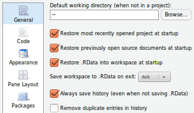

## Learning Objectives

You will learn:

* What packages are
* What a "library" is
* How to view your libraries
* How to install a package
* How to upgrade a package
* How to upgrade all of your packages
* How to load a package into memory
* How to unload a package
* How to uninstall a package
* What an R "session" is
* How to save your session
* How to load a saved session
* How a session is stored
* How to read and write data files
* How to edit, save, and run scripts

## Packages

* Collections of code (functions), data (for examples), and documentation
* Bundled together to make for easier management
* Designed to be managed with a common set of utilities
* Almost 10,000 packages on [CRAN](https://cran.r-project.org/web/packages/)
* Most packages are written by statisticians (for better or worse)
* Most popular packages are very well documented
* In other languages, a "package" is called a "module", "class", or "library"

## R Package Libraries

In R, a "library" is a collection of packages. You use the `library()`
function to load a package from a library on disk into working memory (RAM).

A library is stored as a folder structure on your disk (or the network, etc.).

Site libraries are for packages that all users of your system can access, while
only you can access your personal libraries.

You can install packages to your personal library, but you may not be able to
install packages to site libraries, depending on the permissions settings 
("rights") on your system.

## Viewing your Libraries

If you type the command `library()` at the prompt and press *Enter*, you will
see a list of all of your libraries and their installed packages.

They will be organized by which parent folder the packages reside in. There 
are one or more "site" libraries and one or more "personal" libraries.

To see the parent folders designated as libraries for your session, use the 
`.libPaths()` command.

## Installing Packages

Before using a package, you must first install it from a "repository".

This is typically* done using `install.packages()`. 

RStudio uses the RStudio Comprehensive R Archive Network ("CRAN") mirror [https://cran.rstudio.com](https://cran.rstudio.com) by default, but other 
repositories can be specified.

```{r, eval=FALSE}

# Example: install the "dplyr" package, using the default repository 
install.packages("dplyr")
```

Note that the package name must be quoted. 

`*` For packages from the Bioconductor project (for bio-informatics), there is 
[another method](https://www.bioconductor.org/install/) to install packages. 


## Load a package into memory

Next, you need to load the package into memory (RAM), using `library()`.
```{r, eval=FALSE}
library(dplyr)
```

Notes:

* only one package name is allowed
* the package name is not quoted 
* there is a similar command, `require()`, that is used inside of functions. More on this (with example) later.

The see the list of currently loaded packages, type `(.packages())` and include
all of those parenthesis. Or you can use `search()`.


## Upgrading and Uninstalling Packages

Packages change, and sometimes you will want or need to upgrade (update) them by running the `update.packages()` command:

```{r, eval=FALSE}

# Example of package update
update.packages("dplyr")
```

You can upgrade all of your packages with:

```{r, eval=FALSE}
update.packages()
```

To uninstall (remove) package, run:

```{r, eval=FALSE}

# example of removing a package
remove.packages("dplyr")
```


## *pacman*

There is an additional package called *pacman* which makes package management 
much easier. 

*pacman* can handle all aspects of package management previously discussed using
the "base" R functions. Usually, *pacman's* syntax easier, or involves less typing.

Instead of running `install.packages()` and `library()`, for each package, you 
can do it all with pacman.

```{r, eval=FALSE}

# install pacman the first time
install.packages("pacman")

# load pacman
library(pacman)

# then use the pacman function `p_load()` to load a list of packages
p_load(dplyr, tidyr, stringr, ggplot2)

```

That may not seem any better than `install.packages()` and `library()`, 
because you still have to get *pacman*, but you'll see its usefulness when we 
cover R sessions, files, and scripts next.


## R Sessions and Profiles

An R session is an instance of R running for a certain amount of time in a certain context.

For example, opening RStudio on Plasmid creates an R session.

An R session:
 
* has a working environment (i.e., the "context") with settings, data, and command history (collectively called the **_profile_**)
* starts by loading a *profile* (created for you with defaults if no custom *profile* found)
* has a collection of open data objects, called the **_workspace_**

## Saving and Loading R Sessions

How do you save an R session?

* answer 'yes' when prompted, upon quitting your session
* save your command history and workspace with R commands or menu choices

Example: Save your command history to the current folder (as `.Rhistory`):

```{r, eval=FALSE}
savehistory()
```

Example: Save the workspace (data objects) to the current folder (as `.RData`):

```{r, eval=FALSE}
save.image()
```

In RStudio, you have the menu choices: 

* Session -> Save Workspace
* Session -> Load Workspace As...

## R Working Directory

The "Working Directory" ...

* is the folder that R is currently using to read and save files (unless otherwise specified)
* can be changed at any time with `setwd()`
* can be checked any time with `getwd()`
* starts as the folder that R was started from if run from the command-line
* starts as the user home folder or the top-level of a "project" (e.g., with RStudio)

## R Session Files

The default files for your history (`.Rhistory`) and workspace (`.Rdata`) are stored:

* **_Command-line_**: in the current working directory at the time you save (or exit your session)
* **_RStudio_**: in your home directory (`~`, H:\, etc.)
* **_RStudio_**: in the top level folder of your R project, if you are working in a project
* **_RStudio_**: locations and behaviors are in Tools -> Global Options... -> General



**_Summary_**: Where are they stored? *It depends*.

## R Data Files

The default data file format "native" to R is RData (rda).

Files saved in the format will usually have a name ending with `.RData` or `.rda`.

This is a "binary" (opaque) file format -- it is not to be opened with a text editor.

You can save and load data objects to and from RData files like this:

```{r, eval=FALSE}
x <- 1
y <- "a"
save(x, y, file = "xy.RData")
load("xy.RData")
```

## R Data Files

It is generally a good idea to write data to a standard, "transparent" (i.e., plain text) format
unless you have a good reason to do otherwise.

Writing to a CSV file:

```{r, eval=FALSE}

# Get an example dataset to work with (more on this later!)
data("iris")

# Example of writing the dataset to a csv file
write.csv(iris, "iris.csv")

```

Reading from a CSV file:

```{r, eval=FALSE}

# Example of reading a csv file
myiris <- read.csv("iris.csv")
```

There are many other kinds of file formats and R can work with many of them. See:

* [Quick-R: Importing Data](http://www.statmethods.net/input/importingdata.html)
* [R-Tutor: Data Import](http://www.r-tutor.com/r-introduction/data-frame/data-import)


## R Scripts

In addition to your history file, you can also save your commands into files called "scripts".

* Scripts are "plain text" files edited in a (programmer's) text editor (**_not_** MS-Word).
* Scripts are also called "programs".
* A person who writes a script is a "programmer" - anyone can be a programmer!
* Scripts store a list of commands to be run as a batch.
* It is smart to store your commands in scripts.
* It is smart to make a habit of running your code from scripts instead of the prompt.
* You can use a script many times to automate your work and save time and effort.
* Scripting your analysis makes your work more reproducible, which is very important.
* You can share your code as a script so others can verify your work.

## Running R Scripts

You can run code from an R script by:

* selecting some of the code and running just that code
* running a single line (or block) of code
* saving the file and running ("sourcing") the whole file
* saving and rendering your script with a tool like *knitr* to make a report

The latter approach will bundle the code with the ouput as a single report 
(PDF, HTML, etc.) - more on this to come!


## Creating and Running R scripts

Let's do an example of making and executing R scripts 

Go to: File -> New File -> R Script

A new tab should open in your Source pane "Untitled1". Lets save it as "onramp_iris_script.R

Next, we'll add some basic information using comments like our name, date and description
```{r}

# Joe Coder
# Date: September 30, 2020
# This script is an example of writing scripts in R using the iris dataset.


```

## Creating and Running R scripts

Now, we can write executable code, commenting as we go to document what we're doing for ourselves and for others we share the code with.

```{r}

# load example data
data(iris)

# inspect the "top" of the dataframe
head(iris)
```

## Creating and Running R scripts

Next, we'll modify the dataframe. Let's add a variable that indicates where the samples were collected.

```{r}
# create a variable that indicates where the flowers were collected 
iris$country <- "canada"

# show the top of the dataframe
head(iris)

```

## Creating and Running R scripts

Let's calculate some important summary statistics and store them as variables to the environment

```{r}
# get the mean values for petal characteristics
petal_length_avg <- mean(iris$Petal.Length)
petal_length_avg

petal_width_avg <- mean(iris$Petal.Width)
petal_width_avg

# calculate the correlation between between petal length and width
petal_cor <- cor(x = iris$Petal.Length, y = iris$Petal.Width, method = "pearson")
petal_cor

```

## Creating and Running R scripts

Lastly, we can plot our findings.

```{r}

# plot the petal legths versus widths
p <- plot(x = iris$Petal.Length, y = iris$Petal.Width, 
          xlab = "Petal Length (cm)", 
          ylab = "Petal Width (cm)")

```


## Creating and Running R scripts
After saving and closing your script you can open it and re-run it at a later time, or send it to someone to run themselves.

To run a whole script you can press the "Run" button at the top left of the Source pane.

To go line-by-line put the cursor next to a line and press "Shift" + "Enter"

To run a multiple lines, highlight the desired lines and press "Shift" + "Enter"


## 

```{r child = 'images/questions.html'}
```